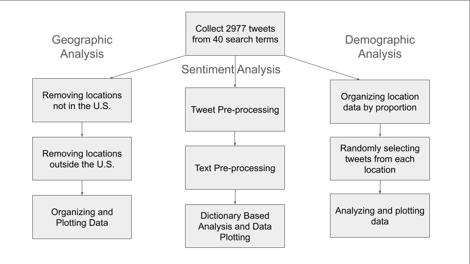

# South-Asian-Twitter-Discourse
Data Analysis on X tweets to identify demographic, location, and sentiment trends: Made as a part of the Computational Media Lab

## Process
The following diagram is a nutshell of our evaluation procedure. Corresponding datasets and scripts are attached in this repository with more detailed instructions below.

## Data Collection
We collected data using [a X Scraper from Apify](https://apify.com/apidojo/tweet-scraper). In order to replicate this project, you will need access to the project data archive. The data is stored in this archive in many spreadsheets with all tweets and their metadata across the search terms used.

## Data Preparation
After the data colletion, we had 2,977 posts. Most of the data preparation for the demographic and geographic analysis was done manually using Microsoft Excel. For sentiment Analysis, it was done through programs in R (shown in the code section below). The processing included removing URLs, special characters, specific derogatory terms, and associated hashtags to focus on relevant content. Text preprocessing involved converting all text to lowercase, removing punctuation, numeric characters, and common stop words using the tm package. Each tweet was assigned a unique identifier for tracking.

## Code
The file "Normalized Version.Rmd" can be copied into any R IDE. Using the "All Tweets - Sheet1.csv" file as the starting data, and then exporting the results into another excel sheet, the project can be replicated. 
